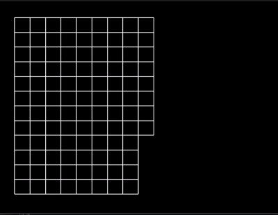

# Description

A Python application that generates and solves mazes using a recursive depth-first search algorithm. The maze generation uses a randomized recursive backtracking approach to create perfect mazes (mazes with exactly one path between any two points).

The application provides a visual representation of both the maze generation and solving process using Tkinter GUI toolkit. It shows:

- Real-time maze construction with animated wall breaking
- Path finding visualization with red lines indicating the current path
- Backtracking visualization with gray lines
- Clear entrance at top-left and exit at bottom-right



## Run Instructions

```bash
python main.py
```

## Future enhancements

- Add other solving algorithms, like breadth first search or A*
- Make the visuals prettier, change the colors, etc
- Mess with the animation settings to make it faster/slower. Maybe make backtracking slow and blazing new paths faster?
- Add configurations in the app itself using Tkinter buttons and inputs to allow users to change maze size, speed, etc
- Make it a game
  - allow the user to choose directions
  - allow the user to race an algorithm
- Make it 3 dimensional
- Time the various algorithms, see which ones are fastest.
